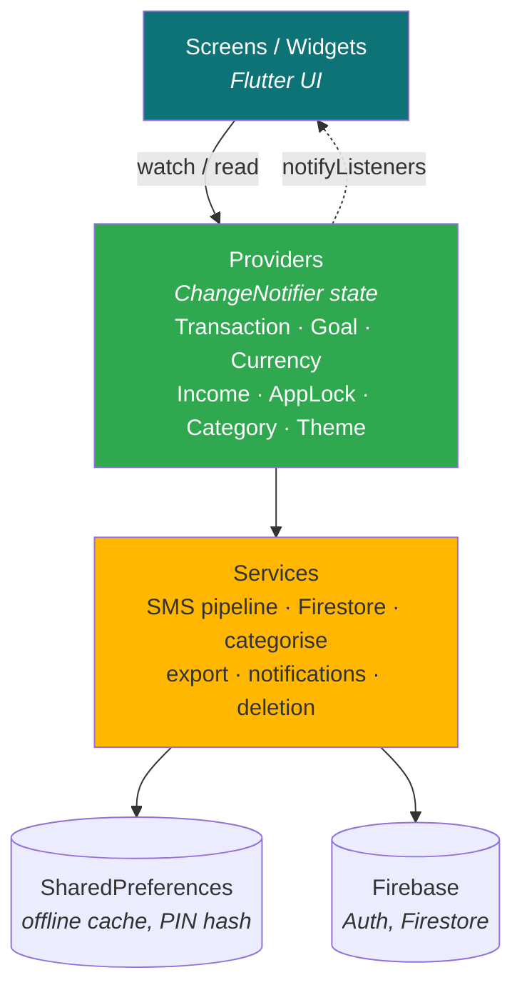
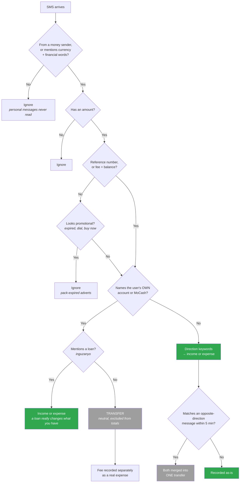

# FinWise

Personal finance tracker whose distinguishing feature is **automatic Mobile
Money transaction detection** — FinWise reads MoMo and bank SMS on the device
and records transactions without the user typing anything.

Flutter · Firebase (Auth, Firestore) · Android

## Market coverage

The app itself is **international**: 13 selectable currencies, applied to every
amount, chart and export.

**SMS auto-detection** works wherever providers send transaction alerts by SMS.
The parser recognises all supported currency codes plus local spellings
(`Frw`, `KSh`, `USh`, `TSh`, `FCFA`), symbol amounts (`$ £ € ₦ ₹`), and senders
across markets — MTN, Airtel, Bank of Kigali, Equity (Rwanda); M-Pesa,
Safaricom (Kenya); Vodacom, Tigo, HaloPesa (Tanzania); OPay, PalmPay, Kuda
(Nigeria).

> **Tuning status:** patterns are verified against real **MTN MoMo Rwanda**
> messages (including Kinyarwanda wording and MoCash). Other providers follow
> common formats but are unverified. When expanding to a new market: add the
> real SMS to `test/sms_transaction_parser_test.dart` first, watch it fail,
> then extend the keyword lists in `services/sms_transaction_parser.dart`.
> That order catches regressions immediately instead of after install.

**No bank connection is required.** FinWise never talks to a bank or mobile
money API — it reads the alert SMS the provider already sends to the phone.
That's why it works in markets with no open-banking infrastructure.

---

## Core concepts

Four ideas explain most of the codebase.

### 1. Transactions are the single source of truth

Nothing is stored as a standing total. Balance, income, spending, charts and
account figures are all **derived** from the transaction list:

```
balance = sum(income) − sum(expenses)
```

This is why deleting a transaction anywhere updates every screen at once —
they all read the same `TransactionProvider`.

### 2. Income target is NOT money

The income figure in Settings is a **planning target**, never a transaction.
An earlier version injected it as a fake "Onboarding income" transaction,
which inflated the balance with money that didn't exist. It now only powers
analysis (savings rate, "vs your usual income").

### 3. Goals reserve money, they don't spend it

Money committed to a goal is a **transfer**, not an expense:

```
Available = Balance − Reserved in goals
```

Reserving lowers what's spendable but doesn't change total money. The expense
happens once, when the goal is marked purchased. Each contribution records
amount, date, source account and an optional note, so reserved money can be
traced and released. This mirrors YNAB/Monzo-style envelopes.

### 4. Moving your own money is neither income nor expense

`TransactionType.transfer` exists because Mobile Money reports ONE movement
between a user's own accounts (MoMo ↔ bank ↔ MoCash) as TWO messages — "sent"
from one side, "received" on the other. Recording both would inflate income
*and* spending with money that never left the user.

Transfers appear in history (neutral, no +/− sign) but are excluded from
`totalIncome`, `totalExpenses`, `balance` and every chart. Any **fee** on a
transfer is recorded separately as a real expense, because that money genuinely
is gone.

Detection needs no configuration and never relies on the user's profile name:

- Wording that names the user's own account ("to your bank", "MoCash",
  Kinyarwanda "kuri konti yawe") marks a transfer immediately
- Otherwise, two messages with the **same amount + same counterparty +
  opposite directions** within 5 minutes are paired into one transfer
- A follow-up message echoing an already-recorded transfer is kept in history
  as a second neutral leg, never as new income or expense

A **loan** (`inguzanyo`) is the deliberate exception — borrowing or repaying
really does change what the user has, so it records as income/expense even
when the message mentions MoCash.

---

## Architecture

Layered, with a one-way data flow. UI never talks to storage directly.



The dotted line is what makes the app feel live: a provider calling
`notifyListeners()` rebuilds every screen watching it, so one deletion
corrects the balance, charts, account totals and history at once.

**Why providers matter here:** every screen reads the same
`TransactionProvider`, so deleting a transaction on the dashboard instantly
corrects the balance, all four charts, account totals and history — with no
manual refresh anywhere.

**Offline-first:** writes go to local storage first, then sync to Firestore.
The app is fully usable with no connection, which matters in the target
market.

### Project layout

```
lib/
├── models/          transaction.dart, goal.dart, currency.dart
├── providers/       state (ChangeNotifier + Provider)
├── services/        SMS pipeline, Firestore, categorisation, export
├── screens/         app screens (incl. faq_screen.dart)
├── widgets/         reusable UI + dashboard cards
└── theme/           app_theme.dart — colours, gradient, typography

test/
├── sms_transaction_parser_test.dart   real provider messages
└── widget_test.dart                   model persistence + transfer rules
```

### Engineering decisions worth noting

Problems solved during development that shaped the design:

| Problem | Solution |
|---|---|
| Concurrent SMS isolates overwrote each other's writes | Per-item storage keys instead of one shared list |
| Same SMS detected twice via different paths | Deterministic IDs from the provider's own transaction reference |
| Background isolate wrote to disk; UI held a stale snapshot | `prefs.reload()` before every drain |
| Permission dialogs triggered the app lock, looking like a crash | Only `paused` counts as backgrounding, plus a suppression flag |
| Onboarding income inflated the balance with money that didn't exist | Income became a planning target, never a transaction |
| Goal contributions double-counted at purchase | Contributions are transfers; the expense is recorded once, at purchase |
| Own-account transfers counted as both income and expense | `TransactionType.transfer`, detected by pairing two messages — no profile name needed |
| Real payments discarded because the SMS ended with "Dial *182..." | Promo filter is skipped when a reference number, or fee + balance, proves the message is genuine |
| Some MTN messages carry no transaction id at all | Synthetic reference derived from the message's own timestamp + amount, so it stays stable across code paths |

### Providers

| Provider | Responsibility |
|---|---|
| `TransactionProvider` | Transactions, balances, per-account totals, cache drain |
| `GoalProvider` | Goals, contributions, reserved-per-account |
| `CurrencyProvider` | Selected currency + formatting (13 supported) |
| `IncomeProvider` | Income target (planning only) |
| `AppLockProvider` | PIN hash, biometrics, auto-lock, attempt limiting |
| `CategoryProvider`, `ThemeProvider` | Custom categories, dark mode |

---

## The SMS pipeline

The most intricate part of the app. Four entry points, **one** recording path.

```mermaid
sequenceDiagram
    participant MTN as MTN / Airtel
    participant E as Entry points<br/>(4 paths)
    participant P as _processSms()
    participant Parser as SmsTransactionParser
    participant Prefs as SharedPreferences
    participant FS as Firestore
    participant UI as TransactionProvider → UI

    MTN->>E: SMS arrives
    Note over E: onNewMessage · background isolate<br/>in-app poll 3s · service poll 15s
    E->>P: sender + body + timestamp

    P->>Parser: parse(sender, body)
    Parser->>Parser: financial? promo? amount? direction? fee?
    Parser-->>P: ParsedSmsTransaction (or null → stop)

    P->>Prefs: _classifyAgainstRecent()
    Note over P,Prefs: duplicate? second half of a transfer?
    Prefs-->>P: none / duplicate / transferPair / transferEcho

    alt duplicate or transfer pair
        P-->>E: discard — nothing recorded
    else new transaction
        P->>Prefs: write detected_sms_tx_&lt;id&gt;
        P->>FS: upsertTransaction (idempotent)
        P->>UI: notification + refreshFromCache()
        UI-->>UI: balance, charts, history update live
    end
```

**Why four entry points:** the `telephony` foreground callback doesn't fire
reliably on all devices, and OEM battery managers (Samsung especially) throttle
background isolates. Polling the inbox is the dependable fallback. Overlap is
harmless because of de-duplication.

**De-duplication** uses the provider's own transaction reference from the SMS
(`FT Id`, `TxId`), so the same message always produces the same transaction id
no matter which path saw it: `momo_29391685510`.

**Per-item storage:** each detection is written to its own
`detected_sms_tx_<id>` key. Writing to one shared list from concurrent isolates
caused earlier detections to overwrite each other.

**`prefs.reload()` matters:** the background isolate writes to disk, but the UI
isolate holds an in-memory snapshot. Without reloading, detections only appeared
after an app restart.

### How one message becomes income, expense, transfer — or nothing

Every branch below exists because of a real bug. Read this before changing
`sms_transaction_parser.dart`.



Key subtleties, each learned the hard way:

- The promo filter is **skipped** when a reference number (or fee + balance)
  proves the message is real — MTN appends "Dial *182..." to genuine receipts.
- Transfer pairing never uses the user's profile name; it matches amount +
  counterparty + timing, so it works for company names too.
- "Mokash" is MTN's actual spelling. Matching only "mocash" silently recorded
  every MoCash transfer as an expense.

### Privacy

SMS content is processed entirely on-device and never uploaded or logged. Only
the extracted amount and description are stored; non-financial messages are
ignored. This qualifies under Google Play's "SMS-based money management"
permitted use.

---

## App lock

Separate from Firebase sign-in, which keeps users logged in indefinitely —
meaning anyone holding an unlocked phone could otherwise read everything.

- PIN stored as a **salted SHA-256 hash**, never plain text
- Biometrics via `local_auth` — biometric data never reaches the app, Android
  returns only true/false
- 5 wrong attempts → escalating cooldown (30s → 60s → 2m → 5m), **persisted**
  so force-quitting can't reset it
- Fingerprint stays available during cooldown (it can't be brute-forced)
- Forgot PIN → sign out and back in with Firebase credentials

> `MainActivity` must extend `FlutterFragmentActivity`, not `FlutterActivity`,
> or `local_auth` throws `no_fragment_activity`.

---

## Testing

```
flutter analyze     # must report "No issues found"
flutter test        # 19 tests
```

`test/sms_transaction_parser_test.dart` is the important one. Every case in it
corresponds to a bug that actually shipped — a promo advert recorded as a
payment, a real payment thrown away as promo, "Mokash" not matching "mocash",
a phone number mistaken for a transaction id. The parser is regex-heavy and
fixes have repeatedly broken each other, so **add the new message as a failing
test before changing the parser**.

---

## Building

```
flutter pub get
flutter run -d <device-id>          # debug
flutter build appbundle --release   # Play Store (.aab)
flutter build apk --release         # sideload / on-device testing
```

Installing a local build over a Play Store install fails with
`INSTALL_FAILED_UPDATE_INCOMPATIBLE` — Play re-signs with its own key, so run
`adb uninstall com.yves.finwise` first.

### Release signing

Signing credentials are **not** in this repository. To build a release:

1. Copy `android/key.properties.example` → `android/key.properties`
2. Fill in your keystore passwords
3. Place your `upload-keystore.jks` in `android/`

Both are git-ignored. **Never regenerate the keystore** — Play requires every
update to be signed with the same key.

You will also need your own `android/app/google-services.json` from a Firebase
project (also git-ignored).

If Gradle can't reach `repo.maven.apache.org`, it's a DNS issue, not code —
switch DNS to 8.8.8.8 or use a mobile hotspot for the first build.

---

## Gotchas worth knowing

- **Savings is not spending.** `Category.savings` is excluded from spending
  charts, top categories and the savings-rate calculation.
- **Never iterate a list while deleting from it** — this caused a
  "Concurrent modification" crash in both Clear All flows. Snapshot the ids first.
- **Warn, don't block.** The app never refuses to record something that really
  happened (e.g. paying from an account showing insufficient funds); it warns
  and lets the user decide, since unrecorded income is the usual cause.
- **Never auto-link a transaction to a goal.** Amount matching is unreliable —
  the user picks the transaction explicitly.

---

## Publishing an update

1. Bump `version:` in `pubspec.yaml` (the build number **must** increase — Play
   permanently reserves a version code once uploaded, even if you cancel)
2. `flutter analyze && flutter test`
3. `flutter build appbundle --release`
4. Play Console → **Production** → **Create new release** → upload
   `build/app/outputs/bundle/release/app-release.aab` → release notes →
   **Save and publish**

The SMS and foreground-service permission declarations carry over between
releases; they only need redoing if the permissions themselves change.

Target API level is pinned (`compileSdk`/`targetSdk = 36` in
`android/app/build.gradle`) rather than inherited from the Flutter SDK — it
silently regressed to 35 once and Play rejected the release.

---

## Not included, deliberately

- **No KYC, no cryptocurrency, no bank API integration** — the SMS approach
  works without any of them.
- **No currency conversion.** Changing currency re-labels amounts rather than
  converting them; the app warns before doing so. Live rates would mean a
  network dependency and ongoing cost, against the offline-first design.
- **No profile pictures.** Firebase Storage requires the paid Blaze plan, and
  photo collection complicates Play's data-safety review. Users get an
  initial-letter avatar.
- **No live chat / admin dashboard.** Support is email + WhatsApp (see
  `services/support_contact_service.dart`); the Firebase console already covers
  user administration.
